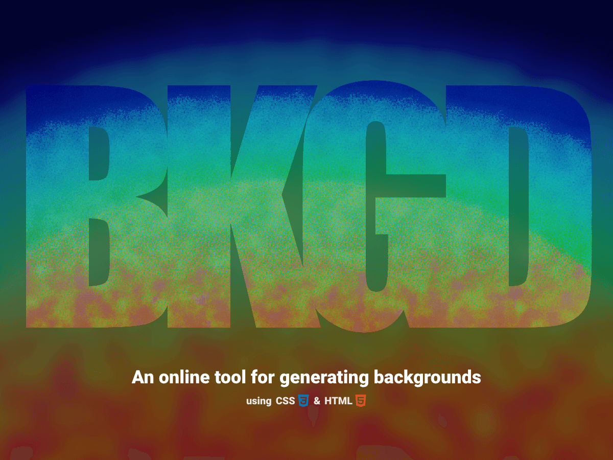

---

---

---

 

# BKGD

> Create beautiful backgrounds for your website or app.

 

**Some Project Goals:**

- Simple UI
- Export as code or image
- Save your backgrounds for later
- Use URL state for:
  - Tracking history of changes (undo/redo)
  - Sharing your background
  - Persisting your state
- Learn new technologies
- Practice deployment
- Use in portfolio

## ROADMAP

> For a more in depth view on, checkout the full [BKGD Roadmap](https://github.com/users/damienbullis/projects/1)

### V 1

- [x] Deploy to Vercel
- [x] Basic UI
- [x] Basic Functionality

### V 1++

- [ ] Future Layer Types
  - [ ] Text
  - [ ] Image
  - [ ] SVG filters
  - [ ] Patterns
  - [ ] Shaders\*
- [ ] Better Export/Download

 

## Issues / Feature Requests

> Having issues? Please let me know by [creating an issue](https://github.com/damienbullis/bkgd-app/issues/new)!

### Known Issues

- Built for Chrome, degraded experience in other browsers.
- Export Image is not great.
- Not built for mobile.
- Not built for loading times/size.
